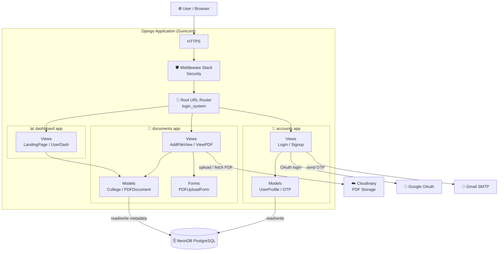
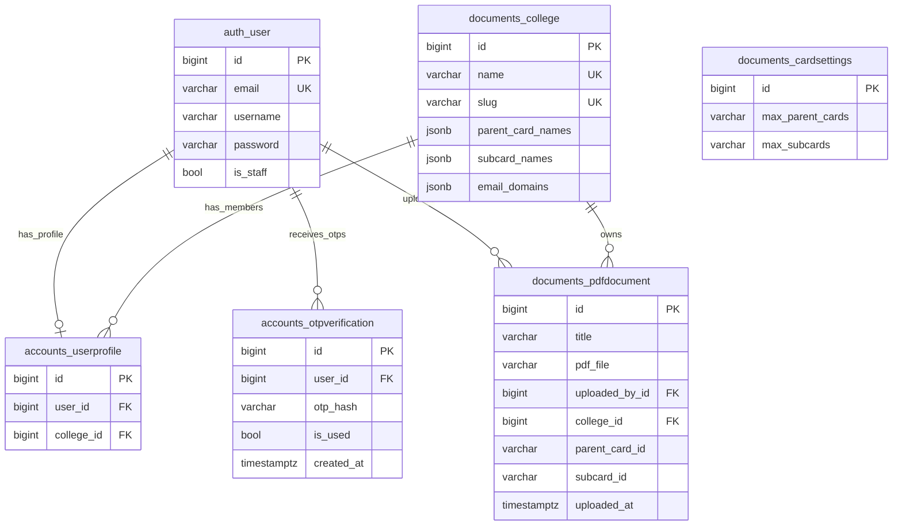

# 📚 ResourceHub – Scalable Document Management System

🔗 **Live:** http://meetmycampus.onrender.com/landing/

---

## 🚀 Overview

ResourceHub is a **scalable document management platform** designed for colleges to upload, organize, and access academic resources efficiently.

It supports:

* Multi-college architecture
* Structured document categorization (parent/sub cards)
* Secure authentication with OTP + OAuth
* Cloud-based file storage
* Clean modular backend design

> Designed with production-ready architecture, focusing on scalability, security, and maintainability.

---

## ✨ Key Features

* 🔐 **Authentication System**

  * Email OTP verification
  * Google OAuth login

* 📂 **Document Management**

  * Upload, categorize, and fetch PDFs
  * Parent/Sub-card structured organization

* 🏫 **Multi-College Support**

  * Data isolation per college

* ☁️ **Cloud Storage Integration**

  * Cloudinary for PDF storage

* ⚡ **Scalable Backend**

  * Modular Django apps (accounts, documents, dashboard)

* 🛡 **Security**

  * Middleware-based protection
  * Secure OTP handling

---

## 🏗 System Architecture

---

## 🧠 Database Design (ERD)

---

## ⚙️ Tech Stack

**Backend**

* Django (Modular Architecture)
* REST APIs

**Database**

* PostgreSQL (NeonDB)

**Cloud & Storage**

* Cloudinary

**Authentication**

* OTP-based Email Verification
* Google OAuth (django-allauth)

**Deployment**

* Gunicorn + Cloud Hosting

---

## 🧠 System Design Highlights

* Modular Django architecture (separation of concerns)
* Multi-tenant system (college-based isolation)
* Cloud storage instead of local filesystem
* Secure OTP authentication with hashing
* Extensible document categorization system

---

## 📈 Scalability & Future Improvements

* Add Redis caching
* CDN for faster delivery
* Async processing (Celery)
* Role-based access control (RBAC)
* Full-text search (Elasticsearch)

---

## ⚠️ Note

Though source code is not publicly available.
This repository showcases system design and live implementation.

---

Me: Aishwaryjain.in
